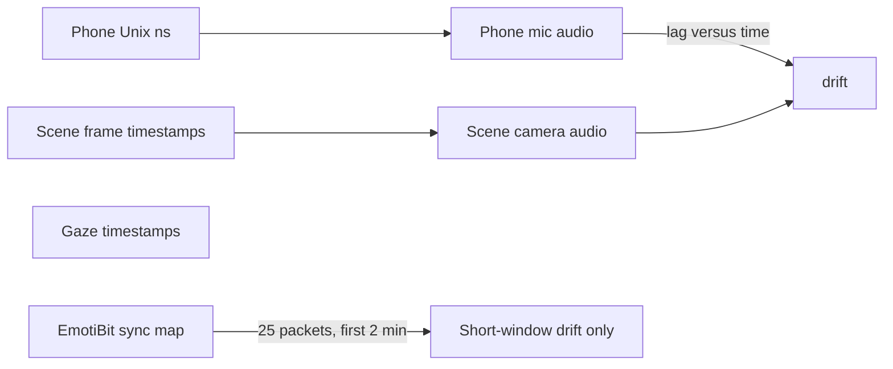

# Synchronization accuracy and drift

The shared timeline is phone elapsed time: `seconds_elapsed`, equal to the phone `time` column (Unix nanoseconds) minus `Metadata.csv` recording epoch. Eye streams and the scene-camera `.time` files are also Unix nanoseconds. EmotiBit `LocalTimestamp` is Unix seconds produced from the device clock by its sync map. Nothing in the current player measures whether those clocks agree. Media file time is treated as phone elapsed time, and the gaze overlay uses a different origin (`info.json` `start_time`) than the scene frame timestamps.

On WALK1 those clocks already disagree before any signal comparison:

- Phone epoch is `2026-05-26 14:09:43` Denver. Phone `time` and `seconds_elapsed` are the same clock (the first sample is 0.877 s on both).
- First scene-camera frame is **+0.305 s** after the phone epoch. `info.json` `start_time` is **−1.396 s**, which is **1.70 s earlier than the first frame**. The overlay uses the info.json value, so gaze-on-video is not on the frame clock.
- Scene video is 64610 frames; `Neon Scene Camera v1 ps1.time` has 64611 stamps. Frame spacing is 33.343 ms, with about 1 µs of variation, so the eye video clock itself is stable. File time 0 is the first frame, not phone t = 0.
- EmotiBit heart rate begins about **577 s** after the phone epoch. `EMdata_timesyncs.csv` has **25** exchanges from 14:19:20 to 14:21:28 Denver (about 2.2 minutes), median round trip **15 ms**, one outlier of **5.1 s**. `EMdata_timeSyncMap.csv` is a single linear segment and does not cover the rest of the 26 minutes of EmotiBit data.
- The scene MP4 has an AAC track for the whole session, and `Microphone.mp4` is the phone mic for the same span. That is the best shared physical signal.

## Ways to compute the interval

Report a separate offset and interval per pair. An event seen at time x in stream A is expected in stream B at x + offset, with the interval around that.

1. **Clock records, no signal matching.** Use this as the baseline and as the quantization floor.
   - Phone sensors: the sample period in `Metadata.csv` (`sampleRateMs`, 10 ms for IMU). The interval is about ± half a sample, and there is no extra drift inside the phone because `time` and `seconds_elapsed` are the same clock.
   - Scene and eye video versus Neon sensors: frame index versus the matching `.time` file. The interval is ± one frame, about ±17 ms, after correcting the one-frame count mismatch.
   - Scene video versus the phone timeline, from timestamps alone: a constant **+305 ms** if file time 0 is shown at phone t = 0. This is a start offset, not proof the clocks stayed together.
   - Do not use `info.json` `start_time` as the video clock.

2. **EmotiBit sync packets.** This is the only explicit clock-exchange record.
   - Parse `TS_sent` as America/Denver and convert to Unix. Pair it with `TS_received` (device milliseconds). The uncertainty of one exchange is about half `RoundTrip`; drop exchanges above a few hundred milliseconds so the 5.1 s outlier does not dominate.
   - Fit offset and rate over those 25 points. The confidence interval is the spread of the residuals, roughly on the order of the median half-round-trip (±8 ms) if the residuals are that tight.
   - State clearly that this interval is measured only for that 2-minute window. Past the last packet, the unmeasured drift is `|rate| × time since the last packet`, added to the interval. It is an extrapolation, not another measurement. The one-row `timeSyncMap` cannot show that drift.

3. **Shared sound, phone mic versus scene-camera audio.** This is the method that can support the sentence you want across devices, for the whole session.
   - Compare envelopes of `Microphone.mp4` (or `Microphone.csv`) and the AAC track in `Neon Scene Camera v1 ps1.mp4`.
   - Cross-correlate in windows (about 20–30 s, stepped through the session). Each window’s peak lag is the offset at that time. The interval is the spread of those lags, or the width of a weak peak when the correlation is low.
   - Drift is the slope of lag versus time. A straight slope is a clock-rate difference. A changing slope is a real drift.
   - Sharp transients (doorways, speech onsets) tighten the interval; steady noise widens it. Low correlation must be reported as “no estimate,” not as zero lag.

4. **Shared motion, as a check, not the primary number.** Phone accelerometer, eye `imu`, and EmotiBit accelerometer can be window-correlated the same way. Heel strikes and turns are usable only when the devices move together. A wrist or pocket delay can look like a sync error, so this interval is an upper bound unless the correlation peak is sharp and stable.

5. **Shared light, as a second check.** Phone `Light` or `Brightness` against the average brightness of the scene video, especially around the doorway marks. Same windowed lag. It fails in steady indoor light.

6. **Same-device media only.** Phone `Microphone.csv` versus `Microphone.mp4` checks the audio file against the phone sensor clock. Eye blink timestamps versus blinks visible in `Neon Sensor Module v1 ps1.mp4` checks that module’s file against the Neon clock. These do not measure the other device.

Human marks in `EventTable.csv` are useful windows to inspect. They are not a sync measurement.

## What can be claimed

- **Inside the phone:** sample quantization only, about ±5 ms for 100 Hz streams. No separate drift.
- **Inside Neon video versus its `.time` file:** about ±1 frame (17 ms), plus the one-frame count mismatch to investigate. The frame clock does not drift (microsecond-level spacing).
- **Scene video as currently played against phone sensors:** about **0.3 s** constant file-start bias, and the gaze overlay is on a different origin by about **1.7 s**. That is a player definition issue, not a measured clock wander.
- **EmotiBit versus the parser host clock:** an interval from the sync residuals, valid for the first ~2 minutes of EmotiBit time only. Full-session drift is not in those 25 packets.
- **Phone versus Neon across the walk:** only method 3 (audio lag versus time) can produce an empirical offset, a confidence interval, and a drift rate. Methods 4 and 5 corroborate it. Timestamp subtraction alone cannot separate “this stream started later” from “this clock is wrong.”

A later report, if you want it built, would be one row per pair: method, offset, interval, drift rate, and the portion of the recording it covers, plus the lag-versus-time curve for the audio comparison. No code changes are included until you choose that.